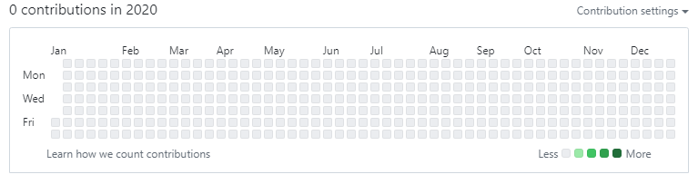
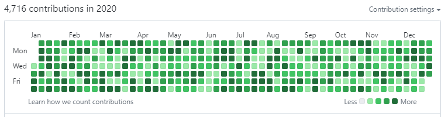

# GitGarden
> Want to look like a highly active and productive developer? We've got you covered.


GitGarden is a powerful CLI utility designed to generate authentic-looking commit histories over a custom date range. It populates an empty GitHub repository with commits spread dynamically across your timeline, creating a natural, green-filled contribution graph.

---

## Visual Showcase

### Before GitGarden


### After GitGarden


---

## Features

- **Automated System Checks**: Automatically verifies your Python environment, Git installation, Git author identity (`user.name` & `user.email`), and internet connectivity before execution.
- **ASCII Contribution Graph Preview**: Renders a terminal-based, color-coded visual representation of the contribution schedule before you commit to running the generator.
- **Two Push Strategies**:
  - **Daily (`daily`)**: Commits and pushes day-by-day (shows incremental progress, slower).
  - **End (`end`)**: Creates all commits locally first and pushes once at the end (extremely fast).
- **Skip Days (Weekend Simulation)**: Exclude specific days of the week (e.g., Saturday and Sunday) to replicate real-world professional work habits.
- **Natural Variety**:
  - Automatically picks conventional/semantic commit messages (e.g., `feat: ...`, `fix: ...`) from `comments.json`.
  - Generates random file names using a customized dictionary to simulate active code editing.
- **Flexible Modes**: Run interactively with a step-by-step wizard or headlessly using Command-Line Interface (CLI) arguments.

---

## Get Started

### 1. Prerequisites
Before running GitGarden, make sure you have:
* **Python 3.x** installed.
* **Git** installed and authenticated to your GitHub account.
* **A New GitHub Repository**: Create a new repository on GitHub (can be public or private). **Ensure it is completely empty**—do not initialize it with a README, license, or gitignore file.

### 2. Clone the Repository
```bash
git clone https://github.com/ayuspandy/gitgarden.git
cd GitGarden
```

---

## Usage Guide

You can run GitGarden in two ways: **Interactive Wizard** or **CLI Flags**.

### Option A: Interactive Wizard (Recommended)
Simply execute the main script with no arguments to enter the step-by-step interactive setup:
```bash
python main.py
```
You will be prompted for:
1. **Repository URL**: The HTTPS/SSH URL of your newly created empty repository.
2. **Branch**: The target branch (defaults to `master`).
3. **Commits per day**: Specific number of commits per day (press Enter for a natural random frequency of 1-25 commits).
4. **File extension**: Extension of dummy files created (defaults to `py`).
5. **Start & End Date**: The date range formatted as `DD-MM-YYYY`.
6. **Days to skip**: Weekdays you want to exclude from commits (e.g., `Saturday, Sunday`).
7. **Push strategy**: Choose to push daily or batch push at the end.

---

### Option B: Command-Line Flags
For automation or power users, pass configuration parameters directly:
```bash
python main.py -r <repo_url> [flags]
```

#### Available CLI Arguments
| Flag | Description | Default | Example |
| :--- | :--- | :--- | :--- |
| `-r`, `--repo` | **[Mandatory]** Remote repository URL | *None* | `https://github.com/user/repo.git` |
| `-b`, `--branch` | Target branch | `master` | `main` |
| `-c`, `--commits` | Number of commits daily | *Random (1-25)*| `5` |
| `-f`, `--file` | File extension for simulated changes | `py` | `js` |
| `-s`, `--start-date`| Start Date (`DD-MM-YYYY`) | *1 year ago* | `01-01-2025` |
| `-e`, `--end-date` | End Date (`DD-MM-YYYY`) | *Today* | `31-12-2025` |
| `-d`, `--skip-days` | Commas/space-separated days of week to skip | *None* | `Saturday,Sunday` |
| `-p`, `--push-strategy`| Push frequency strategy (`daily` or `end`) | `daily` | `end` |

#### Example Command:
```bash
python main.py -r https://github.com/ayuspandy/my-garden.git -s 01-01-2025 -e 01-06-2025 -d "Saturday, Sunday" -p end
```

---

## Platform Compatibility
- **macOS / Linux**: Fully supported.
- **Windows**: Fully supported.

---

## Donations
GitGarden is a free, open-source tool crafted in my spare time. If this helped you build a beautiful garden profile, feel free to show some support:

[Donate](https://cfpe.me/prexoft)

---

## License
GitGarden was created and is maintained by [ayuspandy](https://github.com/ayuspandy).
Licensed under the [Apache-2.0 License](LICENSE).
